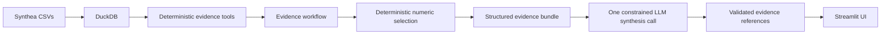

# Clinical Evidence Agent

A portfolio project demonstrating an evidence-grounded AI workflow for
longitudinal synthetic patient records.

**Live demo:** _add the Streamlit Community Cloud URL after deployment_

> Synthetic Synthea data only. This is an engineering demonstration, not a
> clinical-care, diagnostic, or treatment system.

## What it does

The app supports two deliberately constrained questions:

1. **Describe the patient's current medical situation**
2. **Explain how the patient is changing**

It does not provide care plans or treatment recommendations.

## Why the architecture matters

The central design rule is:

**Python/SQL determines the facts; the LLM determines which supported facts
matter and synthesizes them.**

Deterministic code handles patient-relative time windows, utilization,
conditions, medication source records, procedures, numeric observations,
evidence sufficiency, and provenance. The language model receives a
structured evidence bundle rather than raw longitudinal rows.



## Cost-conscious live path

The shipping configuration is intentionally simpler than the frozen
quality-evaluation path:

| Action | LLM calls |
| --- | ---: |
| Browse/select a patient | 0 |
| Build deterministic evidence | 0 |
| Select numeric candidates | 0 |
| First supported answer | at most 1 |
| Repeated cached answer | 0 |

The public demo defaults to `gpt-5.6-luna` with `low` reasoning effort.
The completed multi-patient quality benchmark used `gpt-5.6-sol` with
`medium` reasoning effort.

## Evidence semantics

Several conservative rules are intentional:

- A medication record without a source stop date is **not** treated as proof
  that the patient is currently taking the medication.
- A source-recorded medication reason is not treated as a proven indication.
- Exact-date grouping of events is descriptive, not causal.
- A numeric change by itself is not labeled clinical improvement or worsening.
- Sparse, missing, conflicting, or ambiguous evidence is preserved rather
  than silently resolved by the LLM.
- Substantive synthesis findings carry mechanically validated references back
  to deterministic evidence.

## Evaluation

A frozen 10-patient / 20-case synthetic benchmark completed successfully
with no critical grounding failures. Offline review scored the final
synthesis behavior highly overall, with residual weakness concentrated in
fine-grained salience/materiality rather than factual grounding.

Compact review artifacts can be kept in `evaluation_runs/review/`. The raw
multi-megabyte paid-evaluation payloads are intentionally excluded from the
public repository.

## Run locally

Requirements:

- Python 3.13-compatible environment
- an OpenAI API key
- Synthea CSVs in `data/synthea/`

Create a local `.env` from `.env.example` and set:

```text
OPENAI_API_KEY=your_api_key_here
```

Then run:

```powershell
uv run pytest -q
uv run streamlit run streamlit_app.py
```

## Build the public demo dataset

The public app does not need the full local Synthea export. After the full
data is present locally, create a compact 10-patient synthetic subset:

```powershell
uv run python scripts/build_public_demo_data.py
```

This creates `data/public_demo/`. The Streamlit deployment entrypoint selects
that directory automatically when it exists.

## Deploy

See [DEPLOYMENT.md](DEPLOYMENT.md) for the Streamlit Community Cloud steps.
The OpenAI API key belongs in Streamlit Secrets, never in Git.

## Repository structure

```text
src/clinical_evidence_agent/
  evidence/                 deterministic clinical evidence domains
  evidence_workflow.py      deterministic route -> execute -> bundle workflow
  shipping_pipeline.py      one-call shipping path and cache key
  application_service.py    application-facing service boundary
  llm_synthesis.py          constrained synthesis
  synthesis_contract.py     structured response and evidence-reference contract
  streamlit_app.py          portfolio UI
scripts/
  build_public_demo_data.py
tests/
streamlit_app.py            Streamlit Cloud entrypoint
```

## Limitations

This is a portfolio engineering exercise rather than a production clinical
product. It does not include real PHI, authentication, multi-user controls,
clinical guideline logic, care-plan generation, production observability,
clinician adjudication, or production-grade abuse/rate limiting.

The public demo should therefore remain limited to synthetic records and the
two supported questions.
